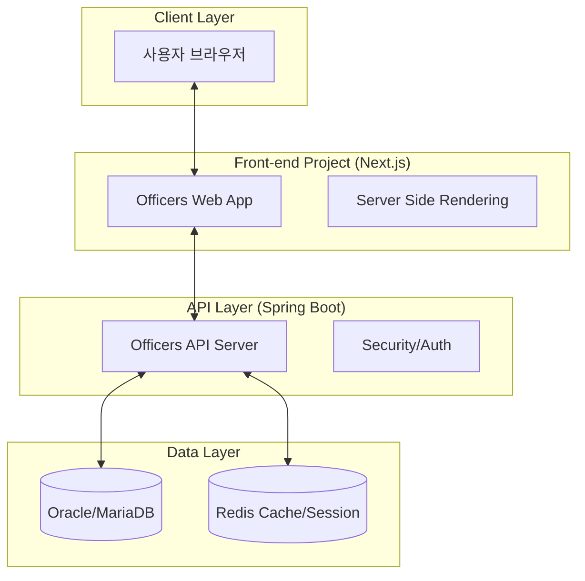

# Officers 시스템 프로젝트 분리 및 현대화 가이드

## 1. 개요
본 문서는 `pig3.1` 프로젝트 내에 통합되어 있는 시스템 관리자용 시스템(`officers`)을 별도의 프로젝트로 분리하여 배포, 유지보수, 운영의 효율성을 극대화하기 위한 아키텍처 제안 및 가이드를 담고 있습니다.

## 2. 제안 아키텍처: Front-end와 API의 완전 분리

가장 권장되는 방식은 **Next.js(Front-end)**와 **Spring Boot(API)**를 완전히 분리하여 구축하는 것입니다.

### 2.1 아키텍처 다이어그램


### 2.2 기술 스택 추천
| 구분 | 추천 기술 | 사유 |
| :--- | :--- | :--- |
| **Front-end** | **Next.js (App Router)** | React 기반의 강력한 프레임워크, SSR/SSG 지원으로 성능 최적화, 개발 생산성 높음 |
| **Back-end** | **Spring Boot 3.x** | 레거시 Spring 4.x 대비 설정 간소화, 내장 WAS(Tomcat)로 배포 용이, 최신 Java(17+) 지원 |
| **Styling** | **Tailwind CSS** | 유틸리티 우선 CSS로 빠른 UI 개발 및 일관된 디자인 유지 |
| **State Management** | **TanStack Query (React Query)** | 서버 데이터 페칭, 캐싱, 동기화 관리에 최적화 |
| **API 통신** | **Axios / Fetch API** | 표준화된 HTTP 클라이언트 |

---

## 3. 분리 구성 방식 비교

### 방식 1: Front-end(Next.js) + 별도 API(Spring Boot) [권장]
- **특징**: `officers` 전용 API 서버를 신규 구축.
- **장점**: 
    - `pig3.1` 레거시 코드의 영향도 제로.
    - 독립적인 배포 파이프라인 구축 가능 (운영 안정성).
    - 최신 라이브러리 및 보안 패치 적용 용이.
- **단점**: 초기 구축 비용(API 마이그레이션) 발생.

### 방식 2: Front-end(Next.js) + 기존 pig3.1 API 활용
- **특징**: `pig3.1`에 REST API만 추가하고 프론트만 Next.js로 구축.
- **장점**: 기존 비즈니스 로직 및 DB 연결 재사용으로 빠른 전환 가능.
- **단점**: 
    - `pig3.1`이 거대해짐(Monolith 유지).
    - `pig3.1` 배포 시 `officers` 프론트에도 영향을 줄 수 있음.
    - 레거시 Spring 버전(4.3)의 한계로 최신 기술 적용 제약.

> [!IMPORTANT]
> **결론**: 장기적인 유지보수와 운영 편의성을 고려한다면 **방식 1(완전 분리)**을 강력히 추천합니다.

---

## 4. 상세 마이그레이션 전략

### 4.1 API 서버 (Spring Boot)
1. **프로젝트 생성**: Spring Initializr를 통해 Spring Boot 3.x 프로젝트 생성.
2. **코드 이전**: `newpig.officers` 패키지의 Controller, Service, Mapper(MyBatis)를 이전.
3. **RESTful 전환**: 기존 JSP 렌더링 방식에서 JSON 반환 방식으로 Controller 수정.
4. **인증/인가**: Spring Security + JWT 또는 Redis 공유 세션을 통한 인증 체계 구축.

### 4.2 프론트엔드 (Next.js)
1. **ES Modules 활용**: `es-modules-migration-guide.md`에서 정의한 모듈화 개념을 React 컴포넌트 단위로 확장 적용.
2. **UI 컴포넌트화**: JSP/Tiles의 레이아웃 구조를 Next.js의 `layout.tsx` 및 `page.tsx`로 전환.
3. **데이터 바인딩**: `TanStack Query`를 사용하여 API 서버와 통신.

---

## 5. 배포 및 운영 (DevOps)

### 5.1 컨테이너화 (Docker)
각 프로젝트를 Docker 이미지로 빌드하여 환경에 구애받지 않는 배포 환경 구축.
- `Dockerfile.api`: Spring Boot 빌드 및 실행.
- `Dockerfile.web`: Next.js 빌드 및 실행.

### 5.2 CI/CD 구성
GitHub Actions 또는 Jenkins를 사용하여 자동 빌드 및 배포 구성.
1. 코드 Push -> 2. 테스트 실행 -> 3. Docker 이미지 빌드 -> 4. 운영 서버 배포 (Rolling Update).

### 5.3 인프라 및 도메인 구성 (AWS)
현재 `pig3.1`이 구동 중인 동일한 AWS EC2 인스턴스 내에 신규 API 서버와 Front-end를 함께 구동할 수 있습니다. 이를 위해 **Nginx(Reverse Proxy)**를 활용한 서브 도메인 라우팅을 권장합니다.

#### 도메인 구성 예시
- **사용자 시스템**: `pigplan.io` (기존 pig3.1)
- **관리자 시스템 (Web)**: `officers.pigplan.io` (신규 Next.js)
- **관리자 시스템 (API)**: `api-officers.pigplan.io` (신규 Spring Boot)

#### Nginx 라우팅 설정 (예시)
```nginx
# 1. 관리자 Web (Next.js)
server {
    server_name officers.pigplan.io;
    location / {
        proxy_pass http://localhost:3000; # Next.js 포트
        proxy_set_header Host $host;
        proxy_set_header X-Real-IP $remote_addr;
    }
}

# 2. 관리자 API (Spring Boot)
server {
    server_name api-officers.pigplan.io;
    location / {
        proxy_pass http://localhost:8081; # 신규 Spring Boot 포트
        proxy_set_header Host $host;
        proxy_set_header X-Real-IP $remote_addr;
    }
}

# 3. 기존 pig3.1 (Tomcat)
server {
    server_name pigplan.io;
    location / {
        proxy_pass http://localhost:8080; # 기존 Tomcat 포트
        # ... 기존 설정 유지
    }
}
```

#### AWS 설정
1. **Route 53**: `officers` 및 `api-officers` 레코드를 생성하여 해당 EC2 인스턴스의 탄력적 IP(EIP)로 연결.
2. **Security Group**: Nginx가 사용하는 80(HTTP) 및 443(HTTPS) 포트가 열려 있는지 확인. (내부 서버 포트 3000, 8081 등은 외부 노출 불필요)
3. **SSL (ACM/Certbot)**: `*.pigplan.io` 와일드카드 인증서 또는 개별 인증서를 Nginx에 적용하여 보안 통신(HTTPS) 강화.

---

## 6. 기대 효과
- **유지보수성**: 관리자 시스템 수정이 사용자 시스템(`pigplan`)에 영향을 주지 않음.
- **확장성**: 필요에 따라 관리자 시스템만 독립적으로 서버 자원 확장 가능.
- **개발 경험(DX)**: 최신 프론트엔드 기술 도입으로 개발 속도 및 품질 향상.
- **운영 안정성**: 장애 발생 시 영향 범위 최소화 (Isolating failures).

---

## 7. 참고 문서
- [ES Modules 마이그레이션 가이드](file:///C:/Projects/pig3.1/pigplan/pigplanxe/docs/es-modules-migration-guide.md)
- [Next.js 공식 문서](https://nextjs.org/docs)
- [Spring Boot 공식 문서](https://spring.io/projects/spring-boot)

---
**작성일**: 2026-01-07
**작성자**: Antigravity (AI Assistant)
